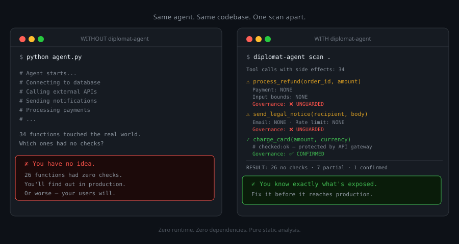
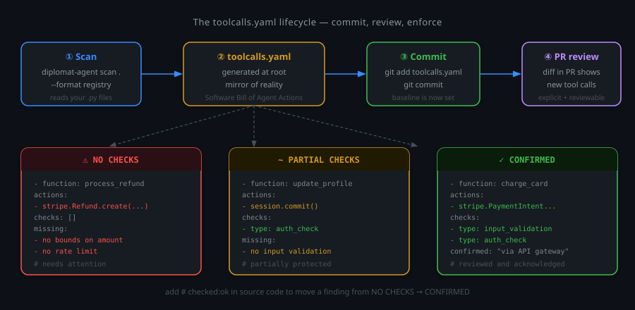
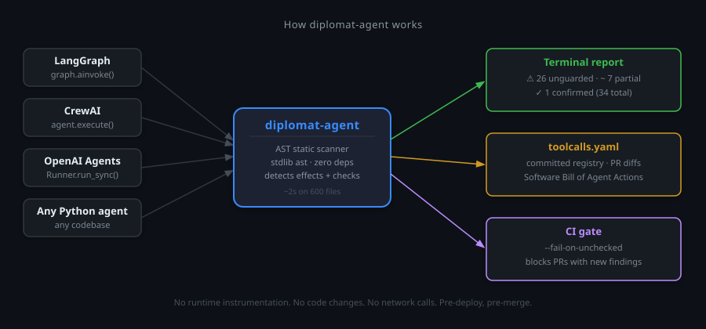

# diplomat-agent

[](https://pypi.org/project/diplomat-agent/)
[](https://python.org)
[](LICENSE)
[](https://github.com/Diplomat-ai/diplomat-agent)
[](https://github.com/Diplomat-ai/diplomat-agent/actions/workflows/ci.yml)

You deployed a Python AI agent.
Do you know every function it can call that writes to a database, sends an email,
charges a card, or deletes data — and which ones have zero checks?

`diplomat-agent` runs a static AST scan and tells you exactly that.
Zero dependencies. 2 seconds on a 1,000-file repo.

```bash
pip install diplomat-agent
diplomat-agent scan .
```

---

## What it looks like

```
diplomat-agent — governance scan

Scanned: ./my-agent
Tool calls with side effects: 12

⚠ process_refund(amount, customer_id)
  Write protection:       NONE
  Rate limit:             NONE
  → stripe.Refund.create() with no amount limit
  Governance: ❌ UNGUARDED

⚠ delete_user_data(user_id)
  Confirmation step:      NONE
  Batch protection:       NONE
  → session.delete() with no confirmation
  Governance: ❌ UNGUARDED

✓ update_order(order_id)
  Governance: ✅ GUARDED

────────────────────────────────────────────
RESULT: 8 unguarded · 3 partial · 1 guarded (12 total)
```



---

## Why this matters for AI agents

In a web app, a human clicks a button. The UI has validation, confirmation
dialogs, rate limits per session.

In an agent, an LLM decides which functions to call, with what arguments,
how many times. It doesn't know your business rules. It can loop, hallucinate
arguments, or get prompt-injected.

**Without guards in the code, there's nothing between the LLM's decision
and the real-world consequence.**

We scanned 16 open-source agent repos. [~71% of tool calls have no guard — measured with inter-procedural tracing across 6,529 tool calls.](docs/REALITY_CHECK_RESULTS.md)

---

## What it detects

40+ patterns across 8 categories:

| Category | Examples |
|---|---|
| Database writes | `session.commit()`, `.save()`, `.create()`, `.update()` |
| Database deletes | `session.delete()`, `.remove()`, `DELETE FROM` |
| HTTP writes | `requests.post()`, `httpx.put()`, `client.patch()` |
| Payments | `stripe.Charge.create()`, `stripe.Refund.create()` |
| Email / messaging | `smtp.sendmail()`, `ses.send_email()`, `slack.chat_postMessage()` |
| Agent invocations | `graph.ainvoke()`, `agent.execute()`, `Runner.run_sync()` |
| Destructive commands | `subprocess.run()`, `exec()`, `eval()` |
| Publish / upload | `s3.put_object()`, `client.publish()` |

What counts as a guard: input validation, rate limiting, auth checks,
confirmation steps, idempotency keys, retry bounds.
[Full list →](docs/acknowledge.md)

---

## Integrate everywhere

### CI — block unguarded PRs

```yaml
- name: Diplomat governance scan
  run: |
    pip install diplomat-agent
    diplomat-agent scan . --fail-on-unchecked
```

### IDE — review what the copilot wrote

Works in your IDE with zero extension to install:

| IDE | How | Setup |
|---|---|---|
| **Copilot Chat** (VS Code, Cursor, Windsurf) | Select "Diplomat Reviewer" in agent dropdown | Copy `.github/agents/diplomat-reviewer.agent.md` |
| **Claude Code** | Ask "scan for unguarded tool calls" | `AGENTS.md` at repo root (included) |
| **Cursor** (native) | Auto-activates on Python files | Copy `.cursor/rules/diplomat-reviewer.mdc` |

### Pre-commit hook

```yaml
repos:
  - repo: https://github.com/Diplomat-ai/diplomat-agent
    rev: v0.5.0
    hooks:
      - id: diplomat-agent
```

### SARIF — native VS Code Problems panel

```bash
diplomat-agent scan . --format sarif --output results.sarif
```

Open with [SARIF Viewer](https://marketplace.visualstudio.com/items?itemName=MS-SarifVSCode.sarif-viewer).
Or upload to [GitHub Code Scanning](docs/sarif.md).

### Scan only changed files

```bash
diplomat-agent scan . --diff-only
```

---

## Generate your agent's SBOM

```bash
diplomat-agent scan . --format registry --output-registry toolcalls.yaml
```



Like `requirements.txt` — but for what your agent can do, not what it
depends on. Commit it. Diff it in PRs. When your agent gains a new
capability, the change shows up in review.

[What is a Behavioral BOM →](docs/behavioral-bom.md)

---

## Benchmarks

| Repo | Type | Tool calls | Unguarded |
|---|---|---|---|
| Skyvern | Application | 753 | 435 (58%) |
| AutoGPT | Application | 668 | 469 (70%) |
| Dify | Platform | 1,361 | 967 (71%) |
| PraisonAI | Framework | 1,281 | 1,106 (86%) |
| CrewAI | Framework | 425 | 317 (75%) |

**Application layer: ~62% unguarded across 2,943 tool calls in 9 repos** (weighted,
v0.5.0 with inter-procedural tracing). Frameworks sit higher — absence of guards there
is by design. We scan both identically. Large repos (>400 tool calls) take longer with
inter-procedural tracing (e.g. CrewAI ~38s).

[Full results on 16 repos →](docs/REALITY_CHECK_RESULTS.md)

---

## Output formats

| Format | Flag | Use case |
|---|---|---|
| Terminal (default) | — | Human review |
| JSON | `--format json` | IDE agents, automation |
| SARIF 2.1.0 | `--format sarif` | VS Code, GitHub Code Scanning |
| CSAF 2.0 | `--format csaf` | Security teams, CERTs |
| Markdown | `--format markdown` | Documentation, reports |
| Registry | `--format registry` | `toolcalls.yaml` SBOM |

---

## Acknowledge a tool call

If a function is intentionally unguarded or protected elsewhere:

```python
def send_alert(message):  # checked:ok — protected by API gateway
    requests.post(ALERT_URL, json={"msg": message})
```

---

## From scanning to runtime

`diplomat-agent` finds what your agent can do.
[diplomat-gate](https://github.com/Diplomat-ai/diplomat-gate) stops it from doing the dangerous parts at runtime.



| Tool              | Stage   | What it does                                                        |
|-------------------|---------|---------------------------------------------------------------------|
| diplomat-agent    | Know    | Maps every tool call with side effects. Static. Pre-deploy.         |
| diplomat-gate     | Decide  | Enforces CONTINUE / REVIEW / STOP at runtime. < 1ms. Zero deps.    |
| diplomat.run      | Prove   | Immutable audit trail, dashboard, compliance export.                |

```bash
# Step 1 — find what your agent can do
pip install diplomat-agent
diplomat-agent scan .
# → 12 unguarded tool calls (8 payments, 4 emails)

# Step 2 — protect them at runtime
pip install "diplomat-gate[yaml]"
# → write gate.yaml, wrap your tools with @gate
```

```python
from diplomat_gate import Gate

gate = Gate.from_yaml("gate.yaml")
verdict = gate.evaluate({"action": "charge_card", "amount": 15000})
# verdict.decision  → STOP
# verdict.violations → [{"policy": "amount_limit", "message": "Amount 15000 exceeds limit of 10000"}]
```

15+ pre-built policies (payments, emails, shell commands).
CONTINUE / REVIEW / STOP in < 1ms. Zero dependencies.

[diplomat-gate →](https://github.com/Diplomat-ai/diplomat-gate) ·
[diplomat.run →](https://diplomat.run) (hosted control plane with hash-chained audit trail)

---

## Standards alignment

- [OWASP Agentic Top 10 mapping →](docs/owasp-agentic-mapping.md)
- [EU AI Act / NIST / DORA compliance →](docs/compliance.md)
- [CSAF 2.0 advisory generation →](docs/csaf.md)

---

## Known limitations

- Static analysis only — no runtime detection
- Python only — TypeScript on the roadmap
- Inter-procedural tracing: same-package top-level functions (depth 2). Class methods,
  cross-package chains, and depth > 2 are not resolved — use `# checked:ok` for guards
  in those paths or external packages
- MCP scanning: Python only (FastMCP / official SDK) — TypeScript/Node MCP servers are out of scope
- MCP scanning: transport-layer auth (OAuth, token gateway) is invisible — "unguarded" means no guard inside the tool function, independent of transport
- MCP scanning: `@mcp.tool` attribute decorator only — bare `@tool` (from direct import) is not detected in v1
- MCP scanning: `@server.call_tool()` low-level dispatcher is detected with a warning; per-tool resolution is not supported in v1
- [Full limitations →](docs/limitations.md)

## Roadmap

- [x] Python AST scanner (40+ patterns)
- [x] `toolcalls.yaml` behavioral SBOM
- [x] CSAF 2.0 + SARIF 2.1.0 output
- [x] CI integration (`--fail-on-unchecked`)
- [x] IDE agents (Copilot Chat, Claude Code, Cursor)
- [x] Pre-commit hook
- [x] `--diff-only` and `--file` modes
- [x] Inter-procedural tracing: decorators + same-package call chains (depth 2)
- [x] MCP server scanning
- [ ] TypeScript support
- [ ] VS Code extension (inline diagnostics on save)
- [ ] PR comment integration

## Requirements

- Python 3.9+
- Zero dependencies (stdlib `ast` only)
- Optional: `rich` (colored output), `pyyaml` (registry)

## License

Apache 2.0 
